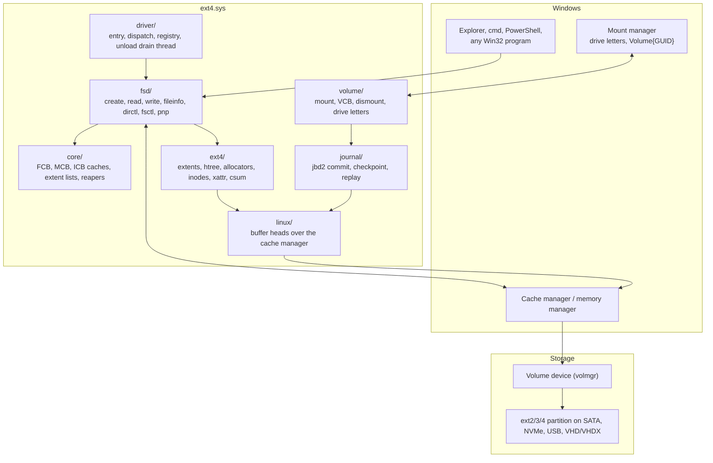
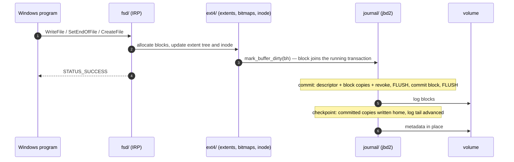
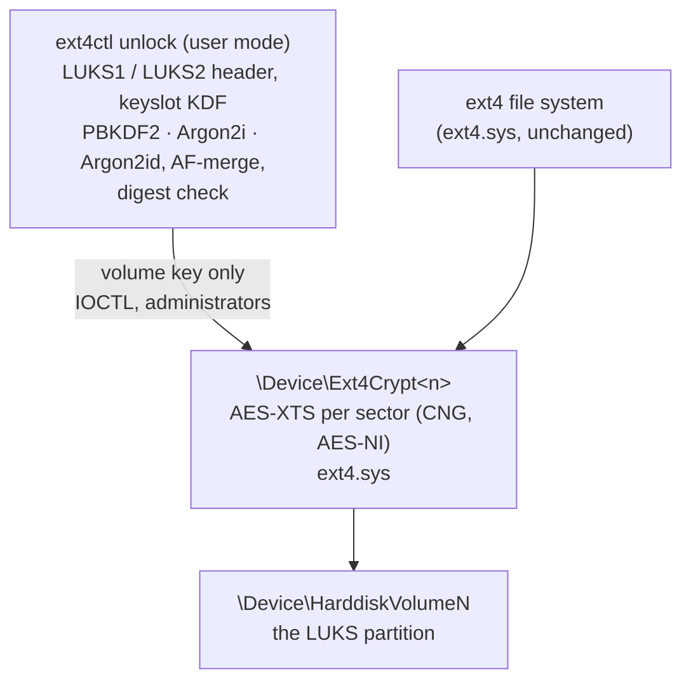
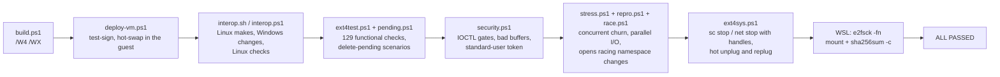

<div align="center">


[](https://github.com/wesmar/Ext4/releases/latest)

**[⬇ Download ext4.7z](https://github.com/wesmar/Ext4/releases/download/latest/ext4.7z)**
&nbsp;·&nbsp;
**[Source Code](https://github.com/wesmar/Ext4/archive/refs/heads/main.zip)**
&nbsp;·&nbsp;
**[All Releases](https://github.com/wesmar/Ext4/releases)**

> No archive password. Extract `ext4.sys` and `ext4ctl.exe`.

[](LICENSE.md)
[]()
[]()
[]()

</div>
> **Development status — final engineering pass**
>
> `ext4.sys` is still receiving its last validation and packaging refinements. The current build is test-signed and is intended for controlled testing on backed-up media. The compatibility, failure-injection and Linux interoperability results below describe the present source tree; they are not a substitute for a backup.

> **Repository policy:** the release archive is not password-protected. Git tracks the active source, project files, tests and documentation. Build outputs, symbols, local tooling, virtual disks and test logs stay outside the repository. Test passphrase defaults in two PowerShell scripts are represented by `<TEST_LUKS_PASSPHRASE>`.

# Ext4 for Windows — Native ext2/ext3/ext4 Read/Write Driver

<br>

<div align="center">

**A drive letter for your Linux partition • journaled writes • `sc stop` in milliseconds**

*jbd2 journal, extents with unwritten preallocation, htree directories, metadata checksums, 64-bit group descriptors*

*Every write verified by Linux: `e2fsck` clean, SHA-256 byte-exact*

</div>

<!-- SCREENSHOTS / VIDEO — drop files into images/ and uncomment:


-->

> **`ext4.sys`** is a native Windows kernel-mode file system driver for ext2, ext3 and ext4 volumes. It registers with the I/O manager, cache manager and mount manager. An ext4 partition receives a drive letter, appears in Explorer and Disk Management, and supports normal Windows file operations: create, write, rename, map and delete. Metadata updates pass through a **jbd2 journal** that Linux can replay. Writes use **unwritten extents** with the same on-disk rules as Linux. Every test run ends with an **`e2fsck`-clean volume and byte-exact SHA-256 verification from Linux**.
>
> The codebase retains parts of **Ext2Fsd** by Matt Wu, **Ext4Fsd** by Bo Branten and Linux ext4/jbd2. Their code, algorithms and licensing scope are identified in [Code Lineage and Redesign](#code-lineage-and-redesign). The active Windows paths were then reorganized, rewritten and tested from Windows through to Linux media verification.

---

## Table of Contents

- [Overview](#overview)
- [Code Lineage and Redesign](#code-lineage-and-redesign)
- [Architecture](#architecture)
- [Write Path and the Journal](#write-path-and-the-journal)
- [Unwritten Extents](#unwritten-extents)
- [Performance Engineering](#performance-engineering)
- [Stopping on Demand — `sc stop`](#stopping-on-demand--sc-stop)
- [Drive Letters for Linux Partitions](#drive-letters-for-linux-partitions)
- [Encrypted Volumes — LUKS](#encrypted-volumes--luks)
- [Security Boundaries](#security-boundaries)
- [Source Layout](#source-layout)
- [Testing and Validation](#testing-and-validation)
- [Supported Features](#supported-features)
- [Known Limitations](#known-limitations)
- [Installation](#installation)
- [Building from Source](#building-from-source)
- [License](#license)

---

## Overview

Windows has no native ext4 file-system driver. On dual-boot and larger multiboot systems, ext4 volumes used by Ubuntu, Qubes OS and other Linux installations appear without a drive letter or `\\?\Volume{...}` link. The same happens when an ext4 disk is attached over USB. Disk Management reports these volumes as unknown.

The ways of reaching an ext4 partition from Windows, and what each one costs:

| Way in | What it costs | Drive letter, every program works? |
|---|---|---|
| `wsl --mount` | a Linux VM, administrator rights, the whole disk handed to WSL | No — files are reached through `\\wsl.localhost` |
| Copy tools (read-only viewers) | one application | No — copy out only, no writes |
| Commercial drivers | a paid licence, closed source | Yes |
| Ext2Fsd / Ext4Fsd | one driver, open source | Yes — the base this driver grew from |
| **`ext4.sys`** | **one kernel driver, open source** | **Yes, journaled, `e2fsck`-clean, stops on demand** |

Design rules the code follows:

- **Linux is the referee.** Every test run ends with the volume detached from Windows, checked by `e2fsck -fn` and mounted by the Linux kernel, which compares every file the driver wrote against its SHA-256. A Windows-side check alone would only prove the driver agrees with itself.
- **No sleeping.** Not one fixed delay in the driver. Background work runs on deadlines and events; the service stops the moment the last handle goes, not after a poll interval.
- **Never write what Linux would not.** A journal that cannot be opened mounts the volume read-only instead of writing unjournaled; a feature the driver does not implement refuses the mount or forces read-only.
- **Warning-free is the minimum.** `/W4 /WX /std:clatest` in both configurations: a warning is a build error.

---

## Code Lineage and Redesign

Parts of the codebase and several core algorithms come from four open-source projects. They provide the ext file-system model, Linux on-disk semantics, Windows file-system scaffolding and the original extended-attribute implementation. Because these components remain in the combined work, the complete source is distributed under the GNU General Public License version 2 (`GPL-2.0-only`).

| Project | Authors | Retained foundation |
|---|---|---|
| **Ext2Fsd** | Matt Wu, with KaHo Ng | IRP dispatch scaffolding, FCB/MCB model, cache manager integration and ext2/ext3 handling |
| **Ext4Fsd** | Bo Branten | ext4 structures, metadata checksums, jbd2 support with 64-bit block numbers and Visual Studio project lineage |
| **Linux kernel** — `fs/ext4`, `fs/jbd2`, `lib/rbtree.c`, `fs/nls` | Linus Torvalds, Stephen Tweedie, Red Hat, Cluster File Systems and the ext4 / jbd2 developers | Extent-tree, htree, checksum and journal algorithms; character set tables |
| **lwext4** | Grzegorz Kostka, KaHo Ng | The original extended-attribute implementation; its BSD notice remains in `ext4_xattr.h` |

My standard for the redesign was mathematical precision: explicit invariants, bounded state transitions, clear ownership, measured hot paths and reproducible failures. The resulting code replaces or substantially rewrites the active paths for writes, allocation, journaling, mount and unload, security checks and hot-path lookup.

What changed on the way to `ext4.sys`, in short:

- **Structure.** The monolithic source tree is divided by responsibility into `driver`, `fsd`, `volume`, `core`, `ext4`, `journal`, `linux`, `nls` and `support`. Each area has its own header; the former umbrella header had 3 400 lines. Before behavior changed, preprocessing proved the split token-identical across 1 615 functions.
- **Journal commits and recovery.** A Windows-native jbd2 commit engine logs every metadata change and commits it before the home write. Linux `e2fsck` or the driver replays an interrupted transaction at the next mount.
- **Stopping and unloading.** `sc stop` works on a live driver with mounted volumes, in milliseconds, with no reboot.
- **Drive letters** for partitions the mount manager treats as hidden (MBR type `0x83`, GPT "Linux filesystem").
- **Dozens of fixes** found by the test suite: data exposure past a write into preallocated space, extents created one block at a time, a block allocator that started every file in group 0, registry buffer overruns, uninitialised return values, unload hangs, reapers polling on timers, extended attribute blocks written without their checksum, a Windows EA write that erased the Linux ACLs of the file, xattr blocks leaked on delete, lazily initialised block bitmaps that never reached the disk, and reference leaks - a refused open, a close cut short on a demoted symlink, a delete taken over by the wrong handle - that kept `sc stop` pending for ever.

---

## Architecture



File data goes through the cache manager like any Windows file system: cached reads and writes are served from the system cache, paging I/O comes back to the driver, which maps file blocks to disk blocks through the extent tree (or the indirect block map on ext2/ext3). Metadata goes through Linux-style buffer heads, which are pinned views of the volume stream in the same cache, so every inode, bitmap, directory block and extent node has exactly one copy in memory.

---

## Write Path and the Journal

Every metadata change passes through one hook, `mark_buffer_dirty`, which attaches the block to the running jbd2 transaction of the calling thread. The volume stream itself will only write byte ranges the driver has registered as dirty, so the cache manager cannot flush a metadata page behind the journal's back: write-ahead ordering is enforced, not hoped for.



Rules the engine keeps, each one learned from a failure it caused:

1. **One hook for all metadata.** Directory blocks that were marked dirty directly used to bypass the journal; after a crash the inodes came back and the directory entries did not. Every site now goes through `mark_buffer_dirty`.
2. **A handle joins a transaction only if it still fits the log**, the rule jbd2's `start_this_handle` enforces; otherwise it asks for a commit and waits. Without it a fast writer filled the log and the commit aborted the journal.
3. **Superseded records retire without I/O.** A block logged again by a newer committed transaction is not written home from the older one, so a hot working set cannot pin the log.
4. **The journal superblock is written with its checksum**, through `jbd2_write_superblock` — otherwise `e2fsck` calls it corrupt and the next mount refuses it.
5. **No journal, no writes.** An external, corrupt or unreplayable journal mounts the volume read-only, as Linux does.

Verified by crashing the VM in the middle of heavy metadata churn: Linux `e2fsck` replays the log and finds nothing to fix; the driver's own replay at the next mount leaves the volume just as clean.

---

## Unwritten Extents

Windows programs usually set the file size first and write the data afterwards — `CopyFile` does exactly that. On ext4 the size change allocates **unwritten extents**: the blocks are reserved and contiguous, but they read as zeros until data is written into them. The write then converts exactly the blocks it covers.

The conversion is where the old code went wrong, twice:

| Problem | Effect | Fix |
|---|---|---|
| A write into the middle of an unwritten extent splits it in three. The first split let its two unwritten halves merge straight back into one, and the second split then marked everything right of the write as initialized | Blocks never written became readable: **stale disk contents visible from Linux** past the end of a large write | The first split passes `EXT4_GET_BLOCKS_PRE_IO`, as Linux `ext4_split_extent` does; the left extent is looked up again before the second split; a split outside its extent now fails with `-EIO` instead of wrapping `ee_len` |
| A block-cache miss left the run length at one block | Every write converted one block at a time and every block became its own extent: **a 1 MB file had 258 extents, an 8 MB file 1 955 and a two-level tree** | The block mapper is asked for the whole rest of the I/O at once and stops at the extent boundary by itself; a converted run is merged with its initialized neighbours |
| `SetEndOfFile` wrote zeros over the whole extension of every file | A 256 MB `SetLength` wrote 256 MB of zeros before the real data | Unwritten extents already read as zeros; only the tail of the old last block is cleared, as Linux `ext4_block_truncate_page` does. ext2/ext3 files, which have no unwritten state, still get the full range zeroed |

Checked from Linux with `debugfs`: a 20 MB file written at an unaligned offset into a preallocated range is now **one initialized extent** followed by the untouched unwritten tail, and every byte outside the written range reads as zero.

---

## Performance Engineering

Every change below was made against a measurement on the same Hyper-V guest.

| Mechanism | Problem it removed |
|---|---|
| Unwritten extents converted per I/O run and merged, no zero-fill on `SetEndOfFile` | One extent per 4 KB block and 256 MB of zeros written before 256 MB of data — see [Unwritten Extents](#unwritten-extents) |
| Allocation goal = first block of the inode's own block group | Every file started its search in group 0; test runs took twice as long. Non-contiguous files **4.1% → 2.0%**, and 1.5% with the extent fixes |
| Deadline-driven reapers for buffer heads, FCBs and name-cache entries, woken by events and by the system low-memory signal | Reapers slept on fixed 10 / 20 s doubling timeouts; stress run median **13.3 s → 9.0 s** |
| Superblock free totals moved by the exact change of one group descriptor | Every block and inode allocation re-summed the counters of **all** groups — 8 192 descriptors, twice, per allocation on a 1 TiB volume; metadata stress median **21.9 s → 13.8 s** in the same session |
| Buffer heads released lock-free unless it is the last reference | Every metadata release took the volume-wide `bd_bh_lock` exclusively, although only the 1 → 0 step touches a list; long-lived group descriptor references made all threads of a volume queue on it — stress median **13.8 s → 5.4 s** |
| Plain opens under the shared volume resource, name lookup under a shared lock; only namespace changes take them exclusively | `IRP_MJ_CREATE` held the volume exclusively for every open, and the path walk held the name-cache lock exclusively across directory reads: every open on a volume queued behind every other. 8 threads opening existing files **~290 ms → ~200 ms**, create + delete **~650 ms → ~420 ms** |
| Idle FCBs of deleted files released in batches of 64; the name reaper retried only after it can make progress; inode hash widened to 4 096 buckets | Deleted files kept their FCB, and so their name, for up to two minutes; the name cache stayed above its limit and its reaper ran ~3 500 empty passes a second under the exclusive lock. Opens racing namespace changes fell **131 000 → 13 000** per 6 s run within a minute; now they hold at **~140 000–150 000** |
| Names freed at dismount regardless of their "recently used" mark, symlink targets released with their links | Every file deleted since the mount leaked ~750 bytes of pool at dismount (160 MB after a day of tests) |
| `MmForceSectionClosed` on file purge and on volume teardown | Data sections kept file objects referenced after the last handle closed; the driver could not stop for minutes after a fresh boot |
| Volume-stream extent registered **before** `CcCopyWrite`, failure reported | A write to the volume stream could leave its dirty range unrecorded when the extent list could not grow |
| Buffer heads mapped cached, as the pinned cache views they are | They were an uncached MDL alias of cached pages: every htree scan and every crc32c ran on uncached memory |
| Sleep-and-retry loops removed from extent lists, block maps and buffer heads | A failed allocation was retried after fixed sleeps; now a failed cache update drops the per-file map, which is rebuilt from disk on the next lookup, and a real failure is reported |
| crc32c by the CRC32 instruction of SSE 4.2, eight bytes a step (chosen by CPUID and a check value at first use, the table otherwise) | Every metadata block - bitmaps, inode tables, directories, extent blocks, the journal - was checksummed a byte at a time from a table, some 5 µs per 4 KiB block |
| A set of the caseless names of each large directory, in memory | Names match without regard to case, the index hashes the exact spelling, so a miss in the index was followed by a scan of the whole directory - and every create is such a miss: n files in one directory cost O(n²). 45 000 files with long names: **425 s → 9 s** |
| The Fcb reaper stops at the first idle Fcb still young (they are kept in the order they became idle), and past its high water mark evicts the oldest | Past 16 384 cached files every close made the reaper scan all of them under the exclusive `FcbLock`, freeing nothing: each batch of 5 000 creates took 2, 4, 7, 10 s and more |
| Inode allocation no longer re-verifies a group descriptor it has just changed | The first inode in a fresh block group made `ext4_init_block_bitmap` check the checksum of the descriptor the allocator had already updated; it failed, and the whole group was marked used - space lost and `e2fsck` errors on every freshly formatted volume |
| `fsync` with one device cache flush, as jbd2 does it: the flush before the commit block, which is written through (FUA). A flush counter tells `FlushFileBuffers` whether one issued after the file's data was written has already completed | Every `fsync` flushed the device cache three times - before the commit block, after it and once more on the way out. 5 000 appends with `FlushFileBuffers` after each: **15.3 s → 9.0 s** |

Copy throughput, 256 MB per test, flushed to disk (`tests\copybench.ps1`), same guest, same host disk:

| Operation | NTFS `C:` | ext4 `E:` before | **ext4 `E:` now** |
|---|---|---|---|
| `SetLength` + write + flush | 218 ms | 1 302 ms | **158 ms** |
| Plain streaming write + flush | 224 ms | 1 053 ms | **145 ms** |
| `File.Copy` | 172 ms | 1 090 ms | **144 ms** |
| Read (cached) | 39 ms | 35 ms | **35 ms** |

`C:` is the guest's NTFS system volume, measured in the same run for scale. ext4 now writes faster than NTFS on the same machine.

The everyday workloads side by side (`tests\fsbench.ps1`: 2 000 files, 256 MB large file; median of two runs, Microsoft Defender told to skip both test directories so that the file systems are compared, not the scanner):

| Workload | NTFS `C:` | ext4 `E:` |
|---|---|---|
| Create 2 000 empty files | 224 ms | **101 ms** |
| Create 2 000 files of 4 KB | 438 ms | **332 ms** |
| Open and close existing files, 3 × 2 000 | 77 ms | **56 ms** |
| Stat 3 × 2 000 files | 63 ms | **37 ms** |
| Rename 2 000 | 265 ms | **212 ms** |
| Delete 4 000 | 265 ms | **171 ms** |
| `mkdir` + `rmdir` 500 trees | 238 ms | **165 ms** |
| Enumerate 4 000 entries with sizes and times, 10 × | **29 ms** | 38 ms |
| 5 000 appends, `FlushFileBuffers` after each | **6 970 ms** | 8 830 ms |
| 20 000 random 4 KB writes / uncached reads | 181 / 2 052 ms | 191 / 2 032 ms |
| 256 MB sequential write + flush / uncached read | 156 / 102 ms | 162 / 115 ms |

Creating files in one directory, 5 000 per batch, empty files (same guest, Defender on): NTFS takes about 1 s per batch whatever the size of the directory, ext4 about 0.5 s - also at 40 000 entries.

| 40 000 files | NTFS `C:` | ext4 `E:` |
|---|---|---|
| Create in one directory | 9 613 ms | **4 204 ms** |
| Delete the directory | 5 258 ms | **3 090 ms** |

With Defender scanning enabled, closing a written file costs about 0.7 ms more on ext4 than on NTFS. Defender rescans closed files on file systems whose change journals it does not use; NTFS and ReFS cache the verdict. Microsoft's exFAT shows the same cost on the same guest: 2 000 closes take 1 429 ms on exFAT, 1 392 ms on ext4 and 174 ms on NTFS. With a Defender exclusion for the volume, the ext4 run takes 5 ms.

---

## Stopping on Demand — `sc stop`

A file system driver on Windows is not meant to be unloaded: `IoRegisterFileSystem` marks the driver object as a base file system driver, and the I/O manager refuses `DriverUnload` for such a driver as long as it owns any device object — reference counts of zero are not enough. `ext4.sys` stops anyway, on a bare `sc stop ext4` or `net stop ext4`, with volumes mounted and handles open:

1. A no-wake kernel timer probes the unload-pending flag of the control device; nothing else in NT signals that a stop was requested.
2. A **drain thread** takes over: it asks the driver itself to prepare for unload, which succeeds only when no volume is left mounted or dismounting, and it waits for the `VolumeReleased` event raised by cleanup, close and VCB destruction — never on a fixed sleep. The one short recheck left covers the window in which the I/O manager still holds a volume reference after `IRP_MJ_CLOSE` has returned.
3. Mounted volumes are dismounted as their handles go: the journal is committed and stopped, caches purged, data sections force-closed, drive letters withdrawn at once so nothing shows the volume as RAW.
4. The control devices are deleted and the last reference is dropped on a system worker thread, which runs `DriverUnload`.

Measured by the test suite:

| Scenario | Time to `STOPPED` |
|---|---|
| Idle, volumes mounted (hot-swap by `deploy-vm.ps1`) | **4 – 290 ms** |
| No open handles | 80 – 98 ms |
| A file handle open during `sc stop` / `net stop`, closed by the test 300 ms later | 305 – 358 ms from the stop request |
| Letters back after `sc start` | 6 – 115 ms |

While a volume is still busy the drain thread says why, in the kernel debug output: the counts that gate the teardown, and every file and file object that has not been closed yet - which is how the last reference leaks were found.

The driver can therefore be replaced without a reboot: `sc stop ext4`, copy the new `ext4.sys`, `sc start ext4`.

---

## Drive Letters for Linux Partitions

The volume manager creates a volume device for every partition, but the mount manager hands out drive letters only to partition types it knows. An MBR type `0x83` or a GPT "Linux filesystem" partition is treated as hidden: no letter, no `\\?\Volume{...}` link, and nobody opens it, so no file system is ever asked to mount it.

`volume\letter.c` listens for both hidden-volume and mounted-device arrivals, including devices already present when the driver loads. It opens each device once so the I/O manager asks the registered file systems to mount it. During reload, Mount Manager may remember `D:` after the live DOS link has gone. The worker restores that link before the open, breaking the wait between a missing path and an unmounted file system. After a successful mount, the driver registers the mounted-device interface on the volume PDO. Mount Manager then creates the `Volume{GUID}` link, restores its recorded letter and removes both when the device leaves. A new volume receives the first free letter from `D:`. `mountvol` and Disk Management see the same assignments.

Hot unplug with a handle open withdraws the letters in under half a second; replugging brings them back just as fast.

---

## Encrypted Volumes — LUKS

Most Linux installations encrypt their partitions with LUKS (dm-crypt): Fedora, Ubuntu and Debian with full-disk encryption, Qubes OS always. `ext4.sys` opens them the way Linux does, split the way Linux splits it:



- **The passphrase never enters the kernel.** `ext4ctl` derives the keyslot key in user mode — Argon2 may ask for a gigabyte of memory, which has no place in a driver — decrypts and merges the key material and checks it against the header's digest. Only the verified volume key goes to the driver, which keeps nothing but the key schedule; `ext4ctl lock`, `sc stop` and shutdown destroy it.
- **The driver adds a disk device of its own** over the encrypted segment. Every sector is AES-XTS with the plain64 tweak, exactly as dm-crypt; the file system mounts on that device like on any partition and knows nothing about encryption. The mount manager is told about the device directly — it has no PnP node — and gives it a drive letter and a `\\?\Volume{...}` name; the LUKS UUID is its unique id.
- **Writes** are never encrypted in place — the caller's pages are the cache. An aligned write is encrypted in the caller's own thread straight into a buffer of its own (the first XTS whitening pass is the copy) and sent on without waiting; the disk's completion finishes it, with no thread switch on the way. **Reads** go to worker threads that read into the caller's pages and decrypt them there; long requests are cut into pieces the threads take in parallel. The workers' buffers are allocated up front, so a paging write always makes progress. LUKS2 sectors of 4 KiB are presented as 512e: a part of a sector is read, merged and rewritten under a lock.
- **Formats:** LUKS1 and LUKS2 (both header copies and their checksums), `aes-xts-plain64` with 256- or 512-bit keys, PBKDF2 (SHA-1 … SHA-512), Argon2i and Argon2id computed with one thread per lane. The KDF, AES-XTS and PBKDF2 code is checked against the RFC 9106, IEEE 1619 and RFC 6070 vectors (`ext4ctl selftest`).

```cmd
ext4ctl list                                    :: partitions: LUKS headers and ext file systems
ext4ctl unlock UUID=bfba416e-... --letter G     :: asks for the passphrase, mounts as G:
ext4ctl unlock 7 --key-file C:\keys\data.key    :: the whole file is the passphrase, as in cryptsetup
ext4ctl status                                  :: what is unlocked, where
ext4ctl lock G:                                 :: dismount, drop the key (--force with open files)
```

`ext4ctl` is a single executable with no runtime dependencies; it works the same over ssh and on Windows Server Core. A partition is named by its number, its NT device name or the UUID of its LUKS header, which unlike the volume number does not change when disks come and go.

Measured on the test disk (LUKS1 PBKDF2, LUKS2 Argon2id 1 GiB / 6 passes / 4 lanes with 4 KiB sectors — the Qubes OS parameters — made by cryptsetup): the functional suite, delete-pending, stress and race tests pass on the encrypted volume as on a plain one; files written from Windows are read back by Linux byte-exact after `cryptsetup open`, and `e2fsck -f` finds nothing — also after `sc stop` with the volumes mounted.

| 128 MB, same guest, same file layout | ext4 | ext4 in LUKS2, AES-256-XTS |
|---|---|---|
| Streaming write + flush | ~85 ms | ~118 ms |
| Uncached read (`FILE_FLAG_NO_BUFFERING`) | 2.1 – 2.5 GB/s | 1.35 – 1.4 GB/s |
| Unlock (Argon2id, 1 GiB, 6 passes, 4 lanes) | — | ~2.3 s |

### LVM inside LUKS — read-only

Qubes OS, and many a Fedora install, put an LVM volume group inside the LUKS container: in Qubes a thin pool holding dom0's root and the private volume of every qube. `ext4ctl lv` maps the logical volumes of an unlocked container as disk devices of their own, **read-only**:

- `ext4ctl` reads the PV label and the current copy of the volume group's text metadata, and turns a volume into a table of runs over the LUKS device. A linear volume is its segments; a thin volume is looked up in dm-thin's own metadata — the pool's superblock, the btree of devices, the btree of block mappings — with contiguous chunks merged and chunks never written left as holes that read as zeros. Thin snapshots are thin volumes of their own and open the same way.
- The driver checks the table (it starts at 0, has no gaps, is sector-aligned and stays inside the LUKS device) and serves reads straight from it, split along the runs and sent on to the LUKS device without waiting. Writes fail and the device reports itself write-protected, so ext4 mounts read-only.
- **Why read-only:** a write to a thin volume may need a new chunk from the pool, which means changing the pool's metadata — the space maps and btrees that Linux's dm-thin owns and checks at the next boot. Reading changes nothing in LVM or dm-thin; the Linux side stays exactly as it was.

```cmd
ext4ctl unlock UUID=0061a882-... --read-only    :: the container itself: no file system on it
ext4ctl lv list 0                               :: the volume group inside \Device\Ext4Crypt0
ext4ctl lv open 0 qubes_dom0/vm-work-private --letter W
ext4ctl lv close W:                             :: or: ext4ctl lock 0 --force closes both
```

Tested on the LVM partition of the test disk, made by LVM in Linux (a linear volume, and a thin volume in a pool with 64 KiB chunks): every file byte-exact against Linux's manifest, writes refused, the container refuses to lock while a volume is open (`--force` closes the volumes first), `sc stop` with the volumes mounted, and `e2fsck -f` in Linux clean afterwards.

---

## Security Boundaries

A file system driver runs every request of every process in kernel mode, so each input a caller controls is checked before it is used:

| Entry point | Rule |
|---|---|
| Control device `\\.\ext4` | Created with a SYSTEM + Administrators ACL; a standard user cannot open it |
| Private IOCTLs (volume settings, mount points, statistics) | Kernel callers or administrators only; buffers shorter than their header are refused before a byte is read; strings from the caller are bounded and terminated by the driver |
| Unload request | Kernel mode only — the service control manager's stop path, never a user program |
| `FSCTL_GET_RETRIEVAL_POINTERS` | Raw user pointers (METHOD_NEITHER): probed, and every store into them guarded, so a buffer unmapped by another thread ends the request, not the system |
| `FSCTL_SET_REPARSE_POINT` | Lengths and offsets checked against the buffer; creating a symlink needs `SeCreateSymbolicLinkPrivilege`, as on NTFS |
| Extended attribute queries | The name list is validated entry by entry before it is walked |
| LUKS unlock and lock | Control device only, administrators only; the request is checked field by field, the key in the request buffer is wiped before the answer is copied back, the plaintext of written data is wiped from the bounce buffers. The decrypted disk device is open to SYSTEM and administrators only; files on it are the file system's to check |

`tests\security.ps1` proves each rule as an administrator and as a standard user (a restricted token of the test thread).

---

## Source Layout

One responsibility per folder, one header per folder, `/W4 /WX` clean.

```
Ext4/
├── src/
│   ├── driver/        # DriverEntry, IRP dispatch and work queue, registry, unload drain thread
│   ├── fsd/           # One file per IRP family: create, read, write, cleanup, close,
│   │                  # fileinfo, dirctl, fsctl, lock, ea, reparse, pnp, fast I/O ...
│   ├── volume/        # Mount and verify, VCB, dismount, volume lock, drive letters,
│   │                  # LUKS disk devices (crypt.c), LVM volumes inside them (lvm.c)
│   ├── crypto/        # AES-XTS over CNG, shared by the driver and ext4ctl
│   ├── unicode/       # Casefolded directories: Linux's UTF-8 NFD / case folding tables
│   ├── core/          # FCB/CCB, MCB name cache, ICB inode table, extent lists, reapers
│   ├── ext4/          # Extent tree, htree, directory entries, block and inode allocators,
│   │                  # group descriptors, superblock, xattr, metadata checksums,
│   │                  # ext2/ext3 indirect block maps
│   ├── journal/       # jbd2: commit, checkpoint, log space, per-thread handles, replay
│   ├── linux/         # Buffer heads over the cache manager, kernel services, rbtree
│   ├── nls/           # Character set tables (cp437 ... cp1255, ISO-8859-x, KOI8, UTF-8)
│   ├── support/       # Disk I/O, pool, name conversion, errno ↔ NTSTATUS, time, debug
│   ├── include/       # ext4fs.h and one ext4fs_<area>.h per folder; linux/ compatibility headers
│   ├── ext4.vcxproj   # WDK kernel-mode driver project
│   └── ext4.rc        # Version resource, generated from include/version.h
├── tools/ext4ctl/     # LUKS unlock and driver control: LUKS1/2, Argon2, BLAKE2b, JSON,
│                      # LVM metadata and dm-thin mappings
├── tests/             # Guest and host test scripts (see Testing and Validation)
├── build.ps1          # Finds VS and the WDK by evidence, builds bin\ext4.sys and bin\ext4ctl.exe
└── ext4.slnx
```

About 48 000 lines of driver C and headers plus 52 000 lines of character set tables, in 181 source files; no file of driver logic is longer than about 1 100 lines.

---

## Testing and Validation



```powershell
# the whole suite on a Hyper-V guest, about two and a half minutes
pwsh tests\run-ext4test.ps1 -Interop -Stress -System -Luks -Features

# corrupted file systems (the e2fsprogs test images; wsl -- bash tests/robust-corpus.sh once)
pwsh tests\robust.ps1

# one piece at a time
pwsh tests\run-ext4test.ps1 -Quick          # functional checks only
pwsh tests\bench-vm.ps1 -Runs 3             # median timings, to compare two builds
```

The host runner copies the guest scripts over ssh, runs them against every ext volume in the guest, then stops the driver, detaches the VHDX, attaches it to WSL and lets Linux judge the result. Every stage has a hard time limit and fails fast with a handle dump instead of waiting on a hang.

| Stage | Workload | Verdict |
|---|---|---|
| Functional | 129 checks: volume queries; sizes from 0 bytes to 20 MB cached, unbuffered and write-through; append, overwrite, truncate, extend, sparse files; memory-mapped I/O; directories, long and international names; rename, move, replace; attributes, timestamps, file IDs; hard links; symbolic links; share modes, byte-range locks, delete-pending; change notification; free space accounting; extended attributes in the inode and in their own block, replaced and deleted; a full disk | 129 ok, 0 failed, ~15 s |
| Security | Private IOCTLs from user mode, with no buffer and with short ones; retrieval pointers with a negative VCN, a VCN past the end and an unmapped output buffer; holes reported as LCN −1; EAs queried by name in another case and for a name that does not exist; the control device, volume settings, mount points and symlink creation as a standard user | 0 failed |
| Interop | Linux (WSL) builds a tree — relative, deep, chained, `..` and dangling symlinks, hard links, modes 0444 / 0644 / 4755, setgid directories, a FIFO, nanosecond times, `user.` and `trusted.` xattrs; Windows reads it, then writes its own tree and changes the Linux one; Linux checks modes, owners, setgid inheritance, links, times and xattrs, then runs `e2fsck` | 0 failed on both sides |
| LUKS | A second test disk built by cryptsetup (`luks-image.sh`): LUKS2 with the Qubes OS KDF parameters and 4 KiB sectors, LUKS2 holding LVM, LUKS1. `ext4ctl` unlocks by UUID; a wrong passphrase is refused; Linux's files are read back byte-exact; a set of awkward sizes, odd-offset overwrites and unbuffered write-through is written; the functional suite runs on the encrypted volume; everything is locked. The LVM container opens read-only, and its linear and thin volumes are mounted and checked against Linux's manifest, writes refused, locking refused while they are open. Then Linux opens the containers, checks Windows's files with `sha256sum -c` and runs `e2fsck -f`, the logical volumes included | 0 failed on both sides |
| Linux features | A disk made afresh each run by `mkfs.ext4 -O casefold`, `debugfs` and `e2fsck -D` (`features-image.sh`): a casefolded directory of 300 Polish, German and mixed-case names; files and directories with `chattr +i` and `+a`; SELinux labels. Windows looks names up folded, refuses a name that folds to an existing one, writes 400 files (splitting index blocks), renames, deletes, makes a directory; tries everything Linux refuses on the `+i` / `+a` inodes; creates in a labelled directory and overwrites a labelled file with an EA buffer. Three `-O mmp` partitions: one released, one marked as under `e2fsck`, one left by a node that died - Windows writes to the first, only reads the second, takes the third over after the protocol's wait; Linux finds the first and the third released by `ext4.sys` and the second untouched. An `-O ea_inode` partition where the kernel set values of 9-30 KB (two files sharing one): Windows reads them, writes a 40 KB one, replaces value inodes by small values and by other value inodes, deletes files that own or share one, and changes a file whose xattr block another file shares. An `-O inline_data` partition where the kernel made small files and directories (one with entries past `i_block`): Windows reads and lists them, appends to, truncates and deletes inline files, creates, deletes and renames inside inline directories, removes an empty one and is refused a non-empty one. Linux runs `e2fsck -f` - which checks every index block against the folded hashes - and checks contents, flags and labels. The same test on the previous driver: `e2fsck` reports the casefolded index corrupt | 0 failed on both sides |
| Stress | 8 threads × create / rename / mkdir / delete, 34 000 operations | 0 errors, 0 left over |
| Parallel I/O | Parallel write / extend / truncate / rename with read-back, 3 runs | 0 failed |
| Delete-pending | One thread, every interleaving that once left a name stuck: delete while another handle is open, a target deleted while open through a symlink, a symlink deleted while open through it, rename then delete, recreate refused while pending, a symlink whose target comes back | 0 failed |
| Race | 4 threads open names while others rename, delete, re-create and point symlinks at them; afterwards every name must be removable and the service must stop | ~150 000 opens, 0 unexpected errors, stop in ~0.3 s |
| Service | 6 cycles of `sc stop` and `net stop`, with and without a handle open, right after the race; letters withdrawn and restored | 0 failed, 110 – 380 ms per stop |
| Hot plug | Test disk removed from the running VM with the driver loaded and a handle open, then re-attached | Letters gone in ~0.5 s, back in ~0.5 s |
| Linux check | `e2fsck -fn` on every partition (4 KB and 1 KB block sizes), then the verification set — files written cached, unbuffered, extended, cut and regrown, written at an offset into preallocated space — mounted by Linux and checked with `sha256sum -c` | `e2fsck` clean, every file byte-exact |
| Driver Verifier | The whole run above with Driver Verifier's standard checks on ext4.sys (special pool, forced IRQL checking that pages out everything pageable whenever a lock is taken, pool tracking, I/O, DMA and DDI compliance checks) | 0 failed, no verifier stop; the leaks and the pageable access under a spin lock it found are fixed |
| Robustness | The corrupted images of the e2fsprogs test suite (219: bad superblocks and group descriptors, looping and out-of-range extent trees, directory hard links and loops, broken htrees, journals, xattr blocks, inline data, checksums), attached as partitions of one disk, a batch at a time (`robust.ps1`): every volume the driver takes is listed, every file read, a file written, renamed and deleted, then the driver is stopped - under Driver Verifier | no crash, no hang: a corrupt volume is refused, mounted read-only or fails the operation, as on Linux. Found and fixed on the way: unchecked superblock geometry, extent trees not checked the way Linux does (an index past the volume hung a read), inode extensions read past the inode, directory aliases, the metadata stream closed after its volume, a leaked VPB |

Two verification modes exist because each caught a real bug: **regrown** (data written, file cut at an unaligned size, grown again without a write — old bytes must not come back) and **offset** (a partial write into a range that was only extended — nothing but the data and zeros may be read).

---

## Supported Features

| ext4 feature | Support |
|---|---|
| `extent`, `huge_file`, `large_file`, `sparse_super`, `flex_bg`, `meta_bg`, `64bit` group descriptors | Read / write |
| `has_journal` (internal jbd2) | Read / write, journaled; replay at mount |
| `dir_index` (htree), `filetype`, `dir_nlink`, `extra_isize` | Read / write |
| `large_dir` (three-level htree, directories past 2 GiB) | Read / write: index blocks split at every level and a level is added under the root when all are full, as in Linux; tested with a three-level index the kernel built and one this driver grew from empty (45 000 names), both checked by `e2fsck` and by the kernel looking every name up through the index |
| `metadata_csum`, `gdt_csum`, `csum_seed` | Read / write, checksums verified and maintained |
| `orphan_file` (the `mkfs.ext4` default since e2fsprogs 1.47) | Read / write |
| `casefold` (`mkfs -O casefold`, `chattr +F`; SteamOS formats its microSD cards so) | Read / write. Names in a casefolded directory are folded as Linux folds them (NFD and full case folding, Unicode 12.1, with the kernel's own tables): the index is hashed on the folded names, `ŁÓDŹ.TXT` finds `Łódź.txt` and `STRASSE.TXT` finds `straße.txt`, a name that folds to an existing one is refused, strict mode refuses names that are not UTF-8, and directories made inside inherit the flag |
| Unwritten (preallocated) extents | Read / write |
| Extended attributes | Read / write, exposed as Windows EAs in the `user.` namespace, names matched without regard to case as Windows expects; other namespaces (POSIX ACLs, security labels, `trusted.`) are neither shown nor touched - replacing a file's EA set replaces its `user.` attributes only |
| SELinux labels (`security.selinux`) | A file or directory made from Windows takes the label of its directory, as the kernel labels when the policy names no transition, so Fedora sees a labelled file, not `unlabeled_t` |
| `chattr +i`, `+a` and the inherited flags | Honoured as on Linux: an immutable file is not written, truncated, renamed, deleted or linked, and shows as read-only; an append-only file only grows at its end; an immutable directory takes and loses no entries, an append-only one only takes them. New inodes inherit their directory's flags (`EXT4_FL_INHERITED`) |
| Symbolic links, hard links | Read / write; symlinks appear as reparse points |
| Nanosecond timestamps and the epoch bits past 2038 | Read / write |
| ext2, ext3 (indirect block maps) | Read / write |
| `bigalloc`, `quota`, `project`, `verity`, `orphan_present` | Mounted read-only |
| `mmp` (multi-mount protection) | Read / write, by the Linux protocol: a volume `e2fsck` is checking mounts read-only, one left in use waits out its owner's check interval and is taken over only if the owner stays silent, a volume another node writes to meanwhile turns read-only with nothing more written; while mounted the sequence is updated on the Linux schedule, and an orderly dismount leaves the volume released. The node name `debugfs dump_mmp` shows is the computer name, the device `ext4.sys` |
| `ea_inode` (xattr values in inodes of their own, up to 64 KiB from Windows) | Read / write, as Linux keeps them: a value too large for the xattr block goes to a value inode (crc32c of the value in its `i_atime`, reference count in `i_ctime` : `i_version`), charged to the owner's `i_blocks`; values two files share (Linux deduplicates them) are counted, and a value inode goes with its last reference - when the attribute is replaced or removed, or the file deleted. Checked by `e2fsck` and by the kernel, which verifies every value against its hash as it reads it |
| Shared xattr blocks (`h_refcount` > 1) | Copy on write: an inode whose attributes change takes a block of its own and leaves the shared one to the others |
| `inline_data` (small files and directories inside their inode) | Read / write. Read where Linux keeps them - `i_block` and the `system.data` attribute, directory entries included (a directory is listed and searched as the block it would be). Anything that changes one moves it to a block first, as Linux does when inline data no longer fits: the file's bytes are written to their block before the inode that points there is journaled |
| `encrypt` | Not mounted |

---

## Known Limitations

1. **Volumes up to 2³² blocks (16 TiB at 4 KB blocks).** The block mapping inside the driver is still 32-bit; a larger volume is refused at mount rather than truncated.
2. **Test-signed only.** Windows loads the driver with test signing enabled or Secure Boot off; there is no Microsoft signature.
3. **No external journals.** A volume whose journal lives on another device is mounted read-only.
4. **POSIX permissions are mapped, not enforced as ACLs.** Ownership can be overridden per volume (`uid`, `gid` in the registry); Windows security descriptors are not stored.
5. **LUKS and LVM.** Ciphers other than AES-XTS are not supported. Logical volumes inside LUKS open read-only, linear (one stripe) and thin ones; striped, mirrored and RAID volumes, a volume group spanning several containers, and a partition table inside a volume (the root volumes of Qubes OS qubes) are not handled — the private volumes of Qubes OS qubes hold ext4 directly and open.
6. **x64 only.** The code has no architecture-specific parts, but only x64 is built and tested.

---

## Installation

The current binary is test-signed, not Microsoft production-signed. Until production signing is available, there are four controlled loading paths. All commands below require an elevated Command Prompt or PowerShell session and a machine you administer.

> **What the loaders do:** DrvLoader and KVC do not change the signature of `ext4.sys`. They temporarily open the Code Integrity path, start the driver, and restore DSE immediately afterwards. If Memory Integrity (HVCI) is active, the machine must reboot before an unsigned driver can enter the kernel.

### DrvLoader — load for the current Windows session

Download DrvLoader with KernelResearchKit from the [KernelResearchKit project page](https://kvc.pl/repositories/kernelresearchkit) or the [KernelResearchKit repository on GitHub](https://github.com/wesmar/KernelResearchKit). Extract `ext4.7z` and KernelResearchKit, then place the driver at a stable path. DrvLoader derives the service name `ext4` from `ext4.sys`; start type `3` is `DEMAND_START`.

```cmd
copy /y ext4.sys "%SystemRoot%\System32\drivers\ext4.sys"
drvloader.exe load "%SystemRoot%\System32\drivers\ext4.sys" -s 3

sc query ext4
fsutil fsinfo drives
```

The command performs one bounded cycle: stop an old instance if present, patch DSE, start `ext4`, and restore DSE. If DrvLoader reports that Memory Integrity is enabled, answer `Y`, let Windows restart, open an elevated terminal and run the same `drvloader.exe load ...` command again. Declining the reboot is suitable only for inspecting offsets; do not attempt to load the driver while HVCI remains active.

The interactive path is equivalent: start `drvloader.exe`, select **Load Driver**, enter the full path to `ext4.sys`, and select start type `3 — DEMAND`.

```cmd
drvloader.exe reload ext4
sc stop ext4
drvloader.exe remove ext4
```

`reload` is useful after replacing the binary during development. `remove` stops the driver and deletes its SCM service entry; it does not delete `ext4.sys`.

### KVC — runtime load with automatic DSE restoration

Download KVC from the [KVC project page](https://kvc.pl/project-kvc) or the [KVC repository on GitHub](https://github.com/wesmar/kvc). Its runtime driver manager supports `load`, `reload`, `stop` and `remove`. It accepts either a full path or a short driver name; a short name resolves to `%SystemRoot%\System32\drivers\<name>.sys`:

```cmd
copy /y ext4.sys "%SystemRoot%\System32\drivers\ext4.sys"
kvc driver load ext4 -s 3

sc query ext4
fsutil fsinfo drives
```

KVC restores DSE after the service starts. On an HVCI system it offers to disable Memory Integrity and reboot; after that reboot, run `kvc driver load ext4 -s 3` again. The driver then remains loaded for the current boot, while DSE is back in its original state.

```cmd
kvc driver reload ext4
sc stop ext4
kvc driver remove ext4
```

### KVC — load during the SMSS boot phase

This is separate from the runtime `kvc driver load/reload` path above. For repeated test boots, `kvc install` registers the native SMSS loader. Keep `ext4.sys` under `System32\drivers`, register it once, then reboot:

```cmd
copy /y ext4.sys "%SystemRoot%\System32\drivers\ext4.sys"
kvc install ext4
shutdown /r /t 0
```

`kvc install ext4` writes the `ext4` entry to `C:\Windows\drivers.ini`, registers `kvc_smss.exe` in `BootExecute`, and uses the boot-time kernel scanner by default; no PDB download or hard-coded kernel offset is required. On a machine with HVCI enabled, the first SMSS pass can schedule one additional reboot. The following pass loads `ext4.sys`, restores the Code Integrity callback, and continues the normal boot.

Verify and remove the boot path with:

```cmd
sc query ext4
fsutil fsinfo drives

sc stop ext4
kvc driver remove ext4
kvc uninstall smss
```

Do not move or replace `ext4.sys` while it is loaded. Stop the service first. Open file handles can delay `sc stop ext4`; the driver completes the stop as soon as the last mounted volume is released.

### Native Windows test-signing path

Without either loader, Windows must accept the test certificate:

```cmd
bcdedit /set testsigning on
```

(Secure Boot has to be off for that setting to take effect.) Reboot after changing `testsigning`, then run:

```cmd
copy ext4.sys %SystemRoot%\System32\drivers\
sc create ext4 type= filesys start= demand error= normal binPath= System32\drivers\ext4.sys DisplayName= "ext4 file system driver"
sc start ext4
```

The Linux partitions get drive letters within a second. `sc stop ext4` takes them away again and unloads the driver; `start= system` instead of `demand` loads it at every boot. LUKS partitions are opened with `ext4ctl unlock` (see [Encrypted Volumes — LUKS](#encrypted-volumes--luks)); copy `ext4ctl.exe` anywhere on the path.

Optional settings live under `HKLM\SYSTEM\CurrentControlSet\Services\ext4\Parameters`: `WritingSupport`, `CheckingBitmap`, `Ext3ForceWriting`, `CodePage`, `HidingPrefix` / `HidingSuffix`, `AutoMount`, and per volume under `Volumes` — `Readonly`, `CodePage`, `MountPoint`, `uid`, `gid`.

> **Before unplugging a disk:** a surprise removal is handled, but the journal gives the guarantee only for what was committed. Eject the volume or stop the service first when you can.

---

## Building from Source

**Requirements:** Visual Studio 2022 or 2026 with the **Desktop development with C++** workload and the **Windows Driver Kit** matching an installed Windows SDK.

```powershell
git clone https://github.com/wesmar/Ext4.git
Set-Location .\Ext4
.\build.ps1                     # Release: bin\ext4.sys, symbols\ext4.pdb
.\build.ps1 -Configuration Debug
.\build.ps1 -Rebuild            # full rebuild; -Clean deletes bin\ and obj\ first
```

`build.ps1` discovers the toolchain from files on disk. A Visual Studio installation qualifies only when it contains `cl.exe` and the kernel-mode driver toolset; `vswhere -products *` also reports products without a C++ compiler. The script selects the highest complete MSVC toolset and Windows Kit by parsed version, then verifies the required kernel headers, libraries and tools. This works with both old and current kits.

The project compiles with `/W4 /WX /std:clatest` in Release and Debug — no warnings, and none suppressed to get there. After a successful build `obj\` is deleted and the PDB files move to `symbols\`; `bin\` contains `ext4.sys` and `ext4ctl.exe`.

The two configurations differ in what they carry, not in how they behave. `DBG`, set by the WDK for Debug only, switches `EXT2_DEBUG`: the Debug build adds assertions, a breakpoint at every internal inconsistency, level-filtered tracing of each IRP with process names and `NTSTATUS` texts, guard bytes and accounting on every pool allocation, and the full object and IRP statistics (`IOCTL_APP_QUERY_PERFSTAT`). The Release build keeps error messages and the one counter the driver itself runs on (cached names, which drive the name-cache reaper) - no per-operation statistics, no shared counters every CPU writes to. The current Release driver is under 1 MB; most of it is character set tables.

| Output | Description |
|---|---|
| `bin\ext4.sys` | The driver |
| `bin\ext4ctl.exe` | LUKS unlock and volume control tool |
| `symbols\ext4.pdb` | Symbols for crash dump analysis, kept out of `bin\` |

---

## Downloads

| Download | Contents |
|---|---|
| [`ext4.7z`](https://github.com/wesmar/Ext4/releases/download/latest/ext4.7z) | Current x64 `ext4.sys` (under 1 MB) and `ext4ctl.exe`; no password |
| [Source tree](https://github.com/wesmar/Ext4) | Driver, control tool, build system, tests and documentation |

The binary archive is the current x64 build:

```text
ext4.7z
├── ext4.sys       under 1 MB
└── ext4ctl.exe
```

The repository excludes binaries, PDB symbols, local utilities, virtual disks and test logs. Two test passphrase defaults are represented as `<TEST_LUKS_PASSPHRASE>`.

---

## License

GNU General Public License version 2 — see [LICENSE.md](LICENSE.md) and [COPYING](COPYING).

- **Author:** Marek Wesołowski (WESMAR)
- **Contact:** marek@wesolowski.eu.org
- **Based on:** Ext2Fsd by Matt Wu, Ext4Fsd by Bo Branten, and the Linux ext4 / jbd2 code
- **Build host:** Windows 10/11 x64, MSVC + WDK, C23
- **Runtime:** Windows 10 / 11 x64
